# 前提提示
此文章重点讲解如何部署于Github Pages上,但是部署起来有些难度。  
实在难以攻克可以参考<a href="https://docs.mizuki.mysqil.com/guide/deploy/Vercel/" target="_blank" rel="noopener noreferrer">部署到Vercel</a>(点击可访问外部链接)这个相对来说比较简单。

## Github仓库创建、绑定和初提交
<span id="githubcommit"></span>

通过github主页左上角NEW或<a href="https://github.com/new" target="_blank" rel="noopener noreferrer">Github-New repository</a>(点击可访问外部链接)进入repository(仓库)创建界面。对于部署在github pages上的仓库,要求仓库名为:`用户名.github.io`*(例如patchouli.github.io)*  
Description中可以填写的对仓库项目的描述,剩下保持默认即可,仓库需要公开且不用添加README等。
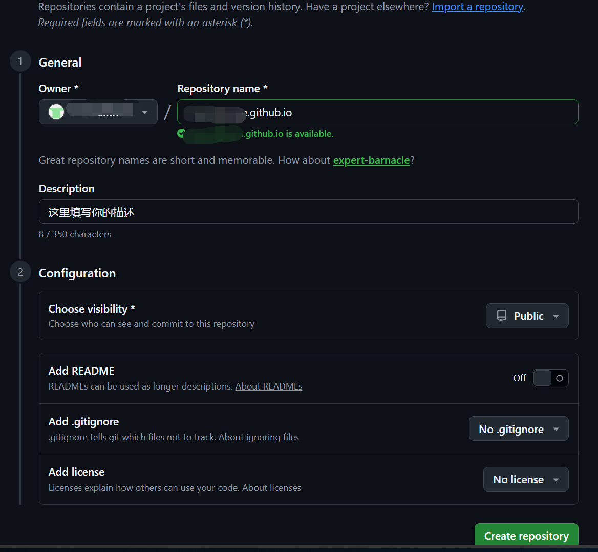
创建完仓库后,Github会显示一个教程界面,首先我们需要先调整传输协议为SSH。SSH拥有免去重复验证、更高的安全性、网络环境适应性等特点。我们先前已经对SSH配置完毕。
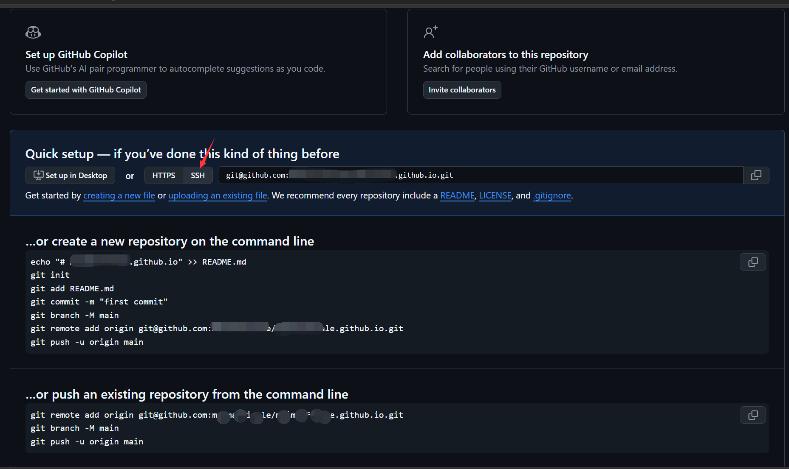
github网页上的内容先放一边,但还是需要重点关注最下方的`...or push an existing...`中的  
`git@github.com:你的用户名/你的用户名/github.io.git`  
<span id="back"></span>

我们可以大致先了解下接下来的流程:
1. [点击跳转](#1)本地仓库(自己电脑上的文件夹)初始化与分支命名
2. [点击跳转](#2)配置好remote远程仓库(可以认为是github仓库)
3. [点击跳转](#3)正式修改本地仓库
4. [点击跳转](#4)提交本地修改至远程  

### 详细操作流程
<span id="1"></span>

1. [返回](#back)先对Blogtest下的Muziki进行Git Bash,根据自身情况输入以下代码进行信息查询或更改:

  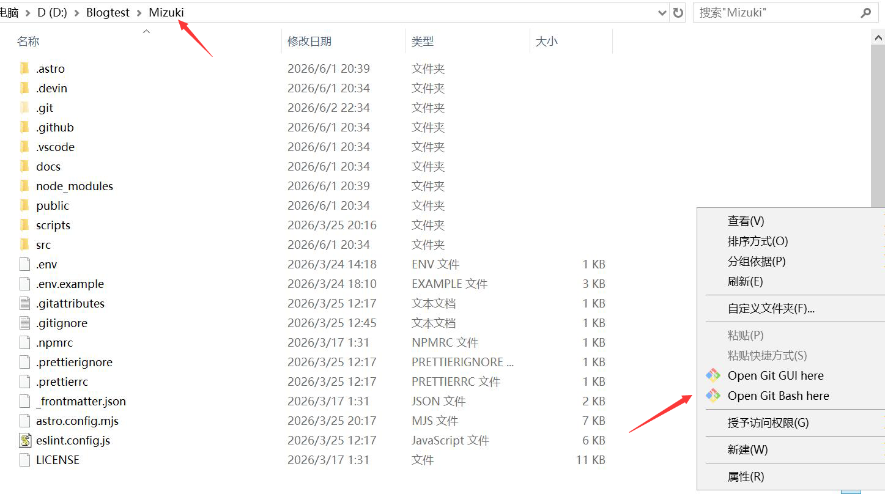
  ```bash
  git init    #无法使用其他git指令时,说明未将文件夹初始化为Git仓库,需要先初始化
  git branch -m main  #必须为main,现在github默认仓库分支为main,便于提交管理
  ```
<span id="2"></span>

2. [返回](#back)对remote远程仓库进行配置
  ```bash
  git remote -v   #查看先前是否绑定过远程仓库
  git remote set-url origin git@github.com:...    #若已绑定其他origin(通过指令下载的mizuki)
  git remote add origin git@github.com:...    #若未绑定其他origin(直接下载的mizuki.zip)
  ```
  其中git@github.com:...直接复制github仓库网页上的内容。  
  其中origin只是个名字,你可以随意更改,但一般都是以origin命名,最后可以`git remote -v`再次查询  
  (当然你也可以选择origin绑mizuki的git,origin1绑定自己的git,但是后续提交时比较麻烦)
  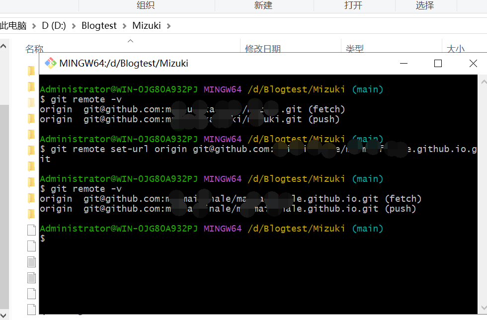
<span id="3"></span>

3. [返回](#back)修改本地仓库
  ```bash
  git status  #检查本地状态,例如修改增减了哪些文件
  git add .   # add .(英文句号)将工作区修改添加到暂存区,点代表当前目录所有修改
  git commit -m "随意描述信息"    #将暂存区内容正式提交到本地仓库
  ```
  其中`git status`运行后会出现很多红色文件,这是正常的。
  其中`git add .`也可以选择`git status`查到的单个文件,如`git add patchouli.txt`,这一步可能会有部分警告,是因为换行的代码不一致,没有影响。
  其中`git commit ...`中-m是message的缩写,用于说明这次提交改动了什么,""中填写你的说明  
  第一次提交commit时,git并不知道你是谁,需要输入你的用户名与邮箱,***`绑定好后再commit一次`***。
  ```bash
  git config --global user.email "you@example.com"  #填写你的github邮箱,如114514@qq.com
  git config --global user.name "Your Name" #填写你的github用户名,如patchouli
  ```
  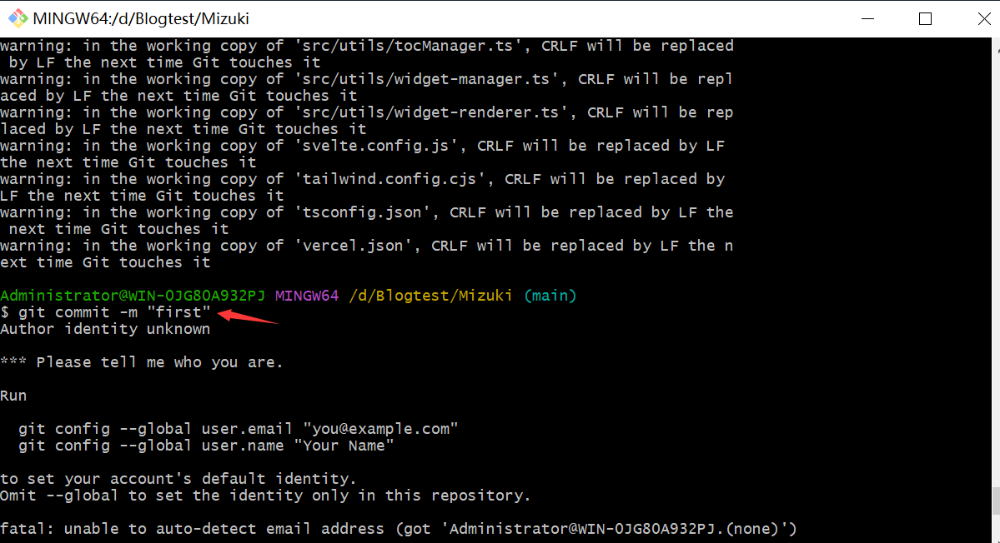
  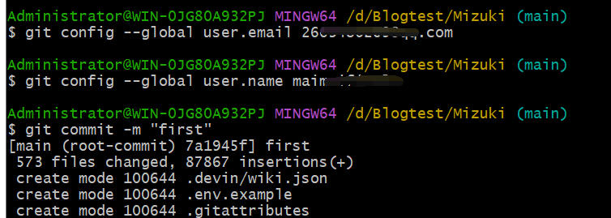
<span id="4"></span>

4. [返回](#back)提交文件至remote
  ```bash
  git push -u origin main #推送本地仓库到github
  ```
  ***后续提交指令只需`git push origin main`即可***
  根据github仓库网页说明,此步为最后一步,首次提交可能会比较慢。
  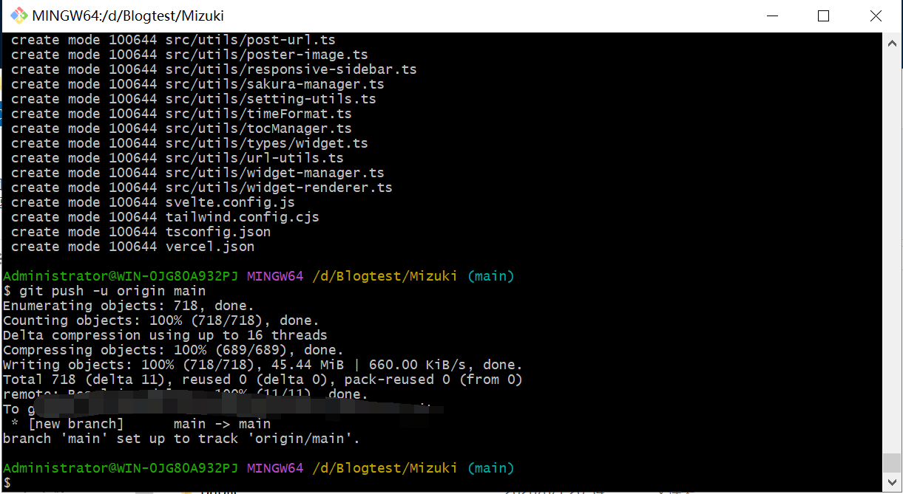
  此时刷新github网页后界面会变化(此时action会进行***部署deploy报错,先选择无视***)
  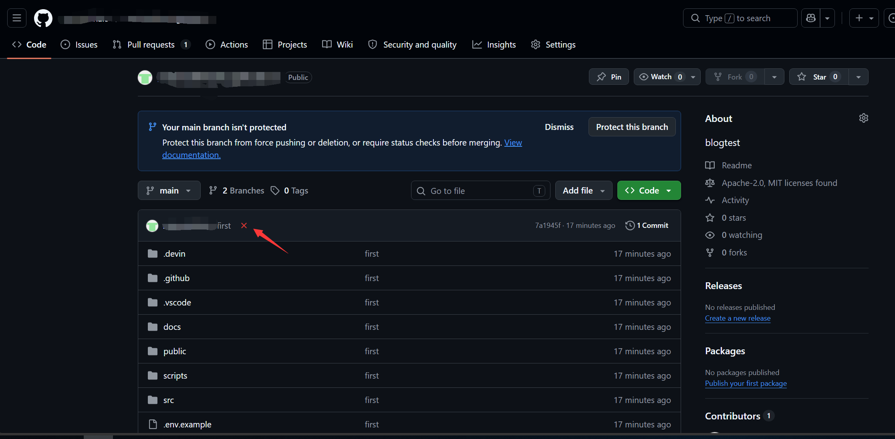


## Github pages部署
<span id="base"></span>

- 修改astro.config.mjs中的配置文件设置base
```javascript
export default defineConfig({
  site: 'https://你的用户名.github.io',   //设置site为你的专属地址,如https://patchouli.github.io
  base: "/",    //设置base为/
  trailingSlash: "always",
});
```
<span id="siteurl"></span>

- 修改config.ts中的配置文件设置siteURL
```javascript
export const siteConfig: SiteConfig = {
	title: "Mizuki",
	subtitle: "One demo website",
	siteURL: "https://你的用户名.github.io/", // 请替换为你的站点URL,以斜杠结尾,注意有引号
	siteStartDate: "2025-01-01",  // 站点开始运行日期，用于站点统计组件计算运行天数
```
<span id="deploy"></span>

- 添加deploy.yml文件
(可能你的项目中已经有该文件,请先查看)
在.github/workflows/目录下创建一个名为`deploy.yml`的文件:
在workflows目录下右键新建txt文件,写入内容后选中重命名(快捷键F2)为`deploy.yml`
```bash
name: Deploy to GitHub Pages

on:
  # 每次推送到 `main` 分支时触发这个“工作流程”
  # 如果你使用了别的分支名，请按需将 `main` 替换成你的分支名
  push:
    branches: [ main ]
  # 允许你在 GitHub 上的 Actions 标签中手动触发此“工作流程”
  workflow_dispatch:

# 允许 job 克隆 repo 并创建一个 page deployment
permissions:
  contents: read
  pages: write
  id-token: write

jobs:
  build:
    runs-on: ubuntu-latest
    steps:
      - name: Checkout your repository using git
        uses: actions/checkout@v5
      - name: Install, build, and upload your site
        uses: withastro/action@v5
        # with:
          # path: . # 存储库中 Astro 项目的根位置。（可选）
          # node-version: 20 # 用于构建站点的特定 Node.js 版本，默认为 20。（可选）
          # package-manager: pnpm@latest # 应使用哪个 Node.js 包管理器来安装依赖项和构建站点。会根据存储库中的 lockfile 自动检测。（可选）
          # build-cmd: pnpm run build # 用于构建你的网站的命令。默认运行软件包的构建脚本或任务。（可选）
        # env:
          # PUBLIC_POKEAPI: 'https://pokeapi.co/api/v2' # 对变量值使用单引号。（可选）

  deploy:
    needs: build
    runs-on: ubuntu-latest
    environment:
      name: github-pages
      url: ${{ steps.deployment.outputs.page_url }}
    steps:
      - name: Deploy to GitHub Pages
        id: deployment
        uses: actions/deploy-pages@v4
```
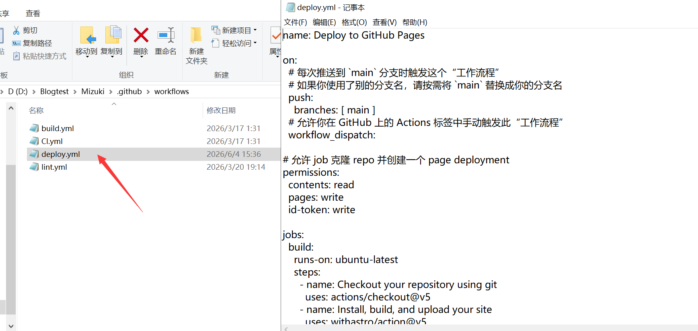
<span id="action"></span>

- 配置Github Action
  点击当前`用户名.io`项目的settings,找到Pages,并修改Build and deployment中的source为GitHub Actions
  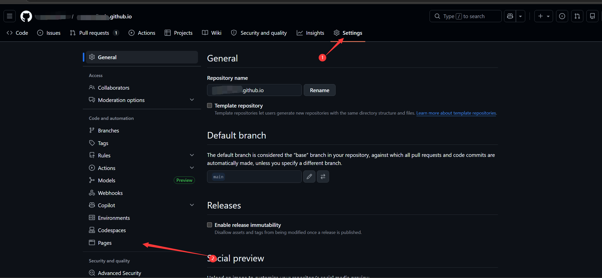
  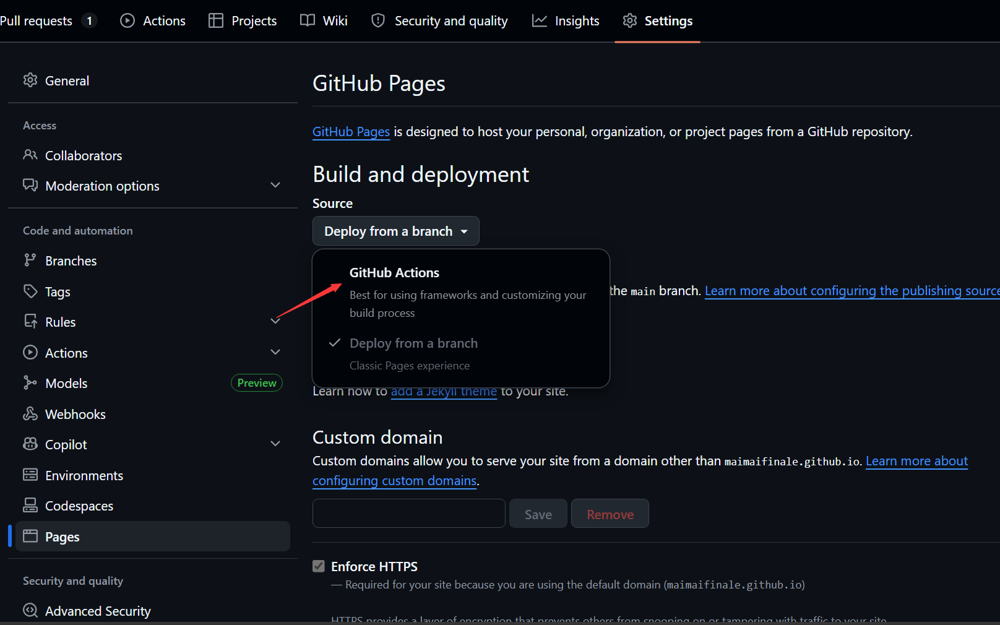

## Github再次提交
至此已经完成所有配置需求,修改任意文件:如config.ts下的语言为zh_CN(再次提交需有所修改)
```javascript
const SITE_LANG = "zh_CN"; // 语言代码，例如：'en', 'zh_CN', 'ja' 等。
```
最后运行修改提交代码进行上传
```bash
git status  #检查当前工作区的状态，确认哪些文件被修改或新增
git add . #将工作区的所有修改添加到暂存区，准备进行归档
git commit -m "信息"  #将暂存区的内容正式提交到本地仓库，并添加本次改动的备注
git push origin main  #将本地仓库的修改正式推送到远程的 main 分支
```
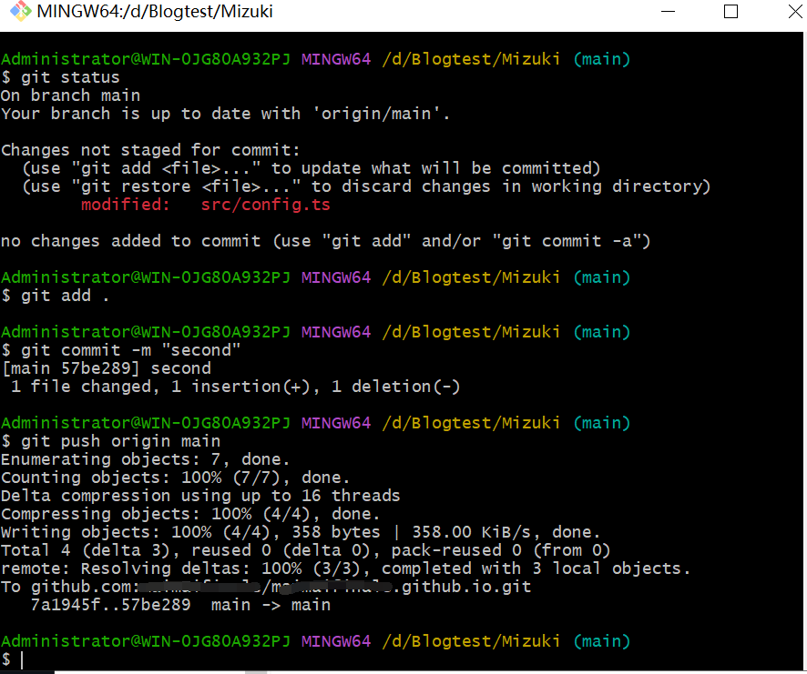

此时前往github.io仓库可以发现提交部署已经成功,若有问题则查看Actions查询问题。
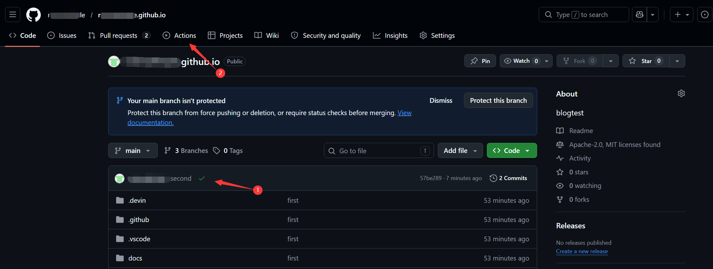

## 访问网站与问题排查
你已经可以通过访问**https://你的用户名.github.io/**来访问自己的网站。
遇到问题可以参考以下内容来排查:  

1. 确保mizuki文件的完整性,有时可能缺少config.ts等重要文件,需要去<a href="https://github.com/LyraVoid/Mizuki/releases" target="_blank" rel="noopener noreferrer">Mizuki/releases</a>处下载压缩文件。
2. [点击跳转](#githubcommit)确保Github可以正常提交文件,只是action中pages无法部署,即提交页面有绿色✅
  
3. [点击跳转](#base)astro.config.mjs文件中site与base都正确修改
4. [点击跳转](#siteurl)config.ts文件中siteURL正确修改
5. [点击跳转](#deploy)正确添加了deploy.yml文件。
  
6. [点击跳转](#action)用户名.io仓库中的settings中的Pages项,正确设置Source为Github Actions
  

## 🌽结语
感谢阅读至此,自定义域名正在更新...
