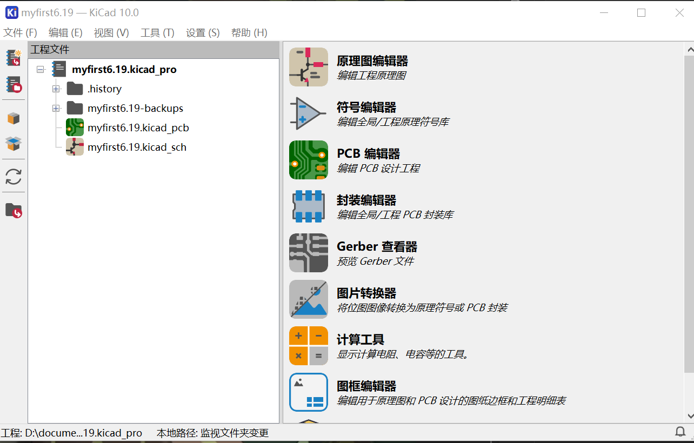
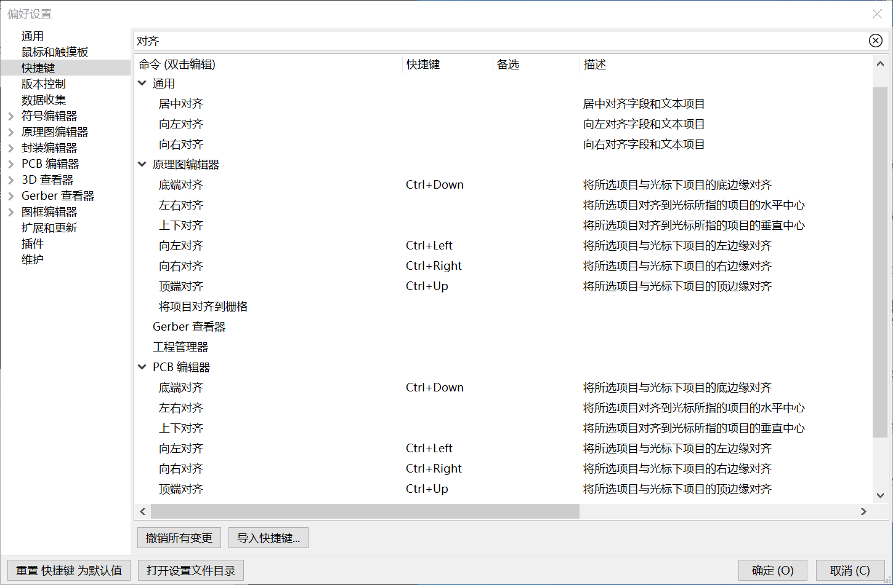

# 界面介绍与基本操作  

  
重点关注四大模块  
1. 符号编辑器：自带的库基本满足大部分符号需求，如有特殊需要则**新建库**→**新建符号**并绘制  
2. 原理图编辑器：放置符号并分配数值与封装，进行连线并检查 ERC，确认无误后导入 PCB  
3. 封装编辑器：自带的库基本满足大部分封装需求，如有特殊需要则**新建库**→**新建封装**并查阅相应数据手册进行绘制  
4. PCB 编辑器：进行绘板产生 Geber 文件 

学习前准备  
- 快捷键设置(持续更新)  
	`Ctrl+,` 或 设置→偏好设置，进入快捷键编辑界面  
	
	

	搜索关键字对齐，并设置快捷键

    | 原理图编辑器  |  底端对齐  | 向左对齐   | 向右对齐   | 顶端对齐   |
    | ------- | :----: | ------ | ------ | ------ |
    | 快捷键     | Ctrl+↓ | Ctrl+← | Ctrl+→ | Ctrl+↑ |
    | PCB 编辑器 |  底端对齐  | 向左对齐   | 向右对齐   | 顶端对齐   |
    | 快捷键     | Ctrl+↓ | Ctrl+← | Ctrl+→ | Ctrl+↑ |